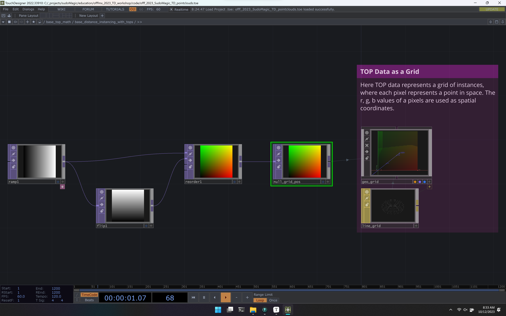
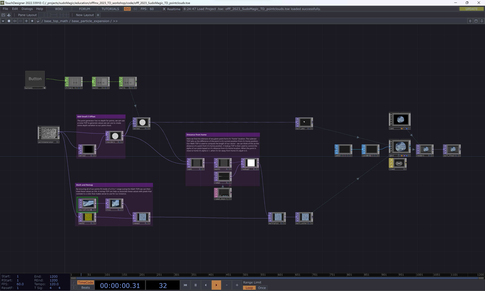
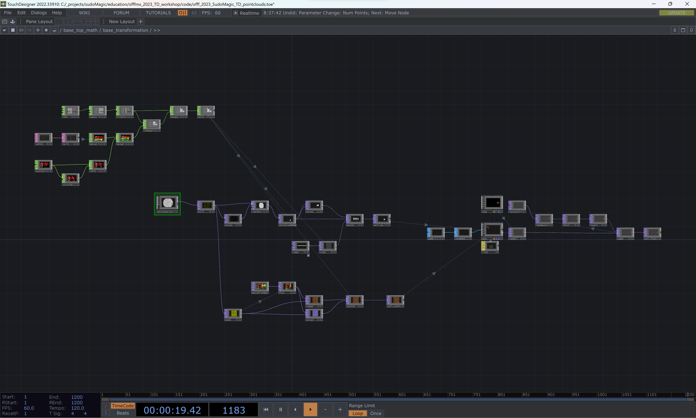
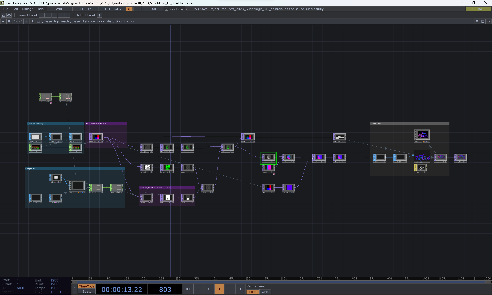

# OFFF CDMX 2023 
# TouchDesigner Intermediate Workshop

## Schedule

| Time	| Lead|
| ---   | ---|
|4:00:PM	| Intro to Intermediate Instancing - Zoe|
|4:30:PM	| Using the pointGenerator Palette COMP - Zoe |
|5:00 PM	| Moving along Noisy Paths - Matt |
|5:30:PM	| Using Distance in TOP space - Matt |
|6:00 PM	| Accumulating Change - Matt |
|6:30:PM	| Distorting Point Clouds - Matt |
|7:00 PM	| Wrap - Matt & Zoe |

## Section Summaries

| File | Summary |
| ---  | ---|
| `code\offf_2023_SudoMagic_TD_pointclouds.toe` | End of workshop example file. |

### Intro to Intermediate Instancing

When you're first getting started with instances it's easy to quickly feel like you've reached the limit of what you can create. As we start to explore some intermediate and advanced techniques for instancing there are more features of the `Geo COMP` we can use. We'll start by taking a closer look at how to work with many more instances by doing the computation for their movement in TOPs.

### Using the pointGenerator Palette COMP

Working with the [pointGenerator COMP]  to generate points that you can map to images. Here we also look at how distance can be used to effect changes in your particles.

### Moving along Noisy Paths

Moving a point cloud from one point to another isn't too tricky, but what if you want to animate your points as they move. In this example we look at how we can transition between two locations and let our points follow a noisy path between.

### Using Distance in TOP space

One way to think about how we control instances when they're in Texture is to work with distance. This example looks at how we can compute a spherical distance with a math TOP.

### Accumulating Change

Accumulating change is slightly different in TOPs than when working with other instance workflows. Here we look at how feedback plays an integral part in the change of particles / and point clouds over time.

### Distorting Point Clouds 

Manipulating point clouds often means thinking about your points spatially. We'll explore how we can use some simple tricks with a bit of math to calculate distance, create bounding fields where we can manipulate our points, and how some of the secrets of the Point Transform TOP. 

## Reference TOE file
| File                               | Summary                                                      |
| ---------------------------------- | ------------------------------------------------------------ |
| `code\references\data`             | Contains several files used for instancing techniques in the workshop |
| `code\references\glsl\sdfLib.glsl` | SDF library from [IQ]                                        |
| `code\references\references.toe`   | Contains reference TOP math techniques.                      |

In the reference `TOE` file you'll find examples on doing the following in TOPs:

* computing distance
* computing rotation
* benefits of using square textures for point clouds
* converting lat long coords to xyz coords
* loading a point file in TOP with a CSV
* SDF examples

<!-- links -->
[IQ]:https://iquilezles.org/articles/distfunctions/
[pointGenerator COMP]:https://docs.derivative.ca/Palette:pointGenerator
